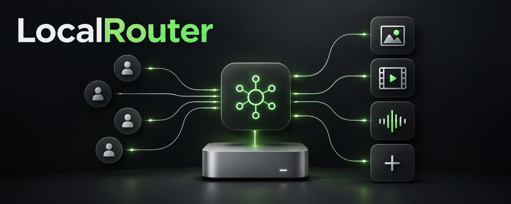

<p align="center"></p>
<p align="center"><a href="https://x.com/jayleaton"></a> <a href="https://buymeacoffee.com/jayleaton"></a></p>

> [!WARNING]
> **Early preview.** LocalRouter is new and under active development: expect bugs and breaking changes. Please [open an issue](https://github.com/jayleaton/localrouter/issues) if something doesn't work.

**LocalRouter runs generative models on your own GPU box and hands them to your agents.** One small daemon owns the
machine: an agent asks for an image or a video over MCP (or an OpenAI-style HTTP API), LocalRouter loads the model
that can do it, makes room for it if it has to, runs the job and unloads the model when it goes idle. Nothing is held
in memory that nobody is using, and the models you care about can stay warm.

It starts on the NVIDIA DGX Spark with two hand-built engines, written in Zig with their own GPU kernels and checked
bit for bit against reference implementations of the same models:

| Model | Can do | On a DGX Spark (GB10) |
| --- | --- | --- |
| **Qwen-Image 2.1** (FP8 by default, closest to the original model; NVFP4 is the faster option) | text to image only; image edit not yet supported | FP8: 1024x1024 in 16.7 s warm, about 22 s from cold; 576x576 in 5.0 s. NVFP4: 12.7 s warm, 16.1 s from cold |
| **MiniMax H3** (video with audio, Turbo 8 steps) | text to video only; image to video not yet supported | 768x448 with stereo audio, warm: a 2.3 s clip (56 frames) in 21.7 s, a 5 s clip (124 frames) in 54 s |

The API accepts image-edit and image-to-video inputs, but both shipped model engines refuse those requests until
their input-image ports land. Check each model's advertised capabilities before submitting a job.

More models, and more kinds (speech, music, 3D), come as adapters: see [Adding a model](docs/ARCHITECTURE.md#adding-a-model).

## Why

- **One door for every agent.** MCP clients and your own scripts add one MCP server and get
  `generate_image` and `generate_video`, with the outputs inline or as links.
- **Memory is managed for you.** Each model says what it needs before it loads. If it does not fit, idle models are
  unloaded: lowest priority first, then least recently used. A model can be marked `keep_loaded` to stay warm
  (an image model and a voice model side by side) and still give way when a video job needs the whole machine.
- **Fast.** The engines read their weights at the drive's speed (direct I/O, about 12 GB/s on the Spark), run
  NVFP4 / FP8 / INT8 kernels written for the GPU they ship on, and capture each sampling step as a CUDA graph.
- **Correct.** Every engine is verified operation by operation against a Python reference of the model, then from
  prompt to pixels and audio samples, on the hardware it runs on. Speed work keeps those bits or it does not ship.
- **Small.** One Zig binary. The idle daemon uses a few MB and no GPU memory. Every loaded model is its own process,
  so unloading returns all of its memory and a crash costs one job.

## Install on a DGX Spark

```bash
git clone <this repo> localrouter && bash localrouter/tools/spark/install.sh
```

The installer checks the machine (GPU, Docker with the NVIDIA runtime, disk), downloads the official checkpoints and
converts them inside NVIDIA's PyTorch container (the first run takes a while and needs about 200 GB free; the converted
image DiT weights are verified against committed reference digests), builds and starts the service (it restarts with the machine), makes
one image and a one-second clip through MCP as a check (printing the clip's wall time), and prints how to connect
agents. `MODELS=image` or `MODELS=video` installs just one (about 110 GB free for images only; the default, both,
needs about 200 GB). The image model is FP8 (`qwen-image-2.1`, kept warm); `PRECISIONS="fp8s nvfp4"` also builds the
faster NVFP4 pack and serves it as `qwen-image-2.1-nvfp4`. LocalRouter listens on `127.0.0.1` only unless you say
otherwise: on a terminal the installer asks "Make LocalRouter reachable from your tailnet? [y/N]" once, and remembers the
answer in `.env` under `LOCALROUTER_HOME`. Re-running it updates the service using the existing packs. The complete two-model installer still needs an
end-to-end check on a DGX Spark; the video installation path has only been exercised with stubs.

Prebuilt Qwen-Image 2.1 packs are available as an optional download from
[Hugging Face](https://huggingface.co/jayleaton/localrouter-qwen-image-2.1), for non-commercial research or evaluation
only under the Qwen Research License. The installer still converts the official checkpoint locally by default.

## Expose it to your tailnet

By default LocalRouter listens on `127.0.0.1`, so only this machine can reach it. To serve your Tailscale network:
`LOCALROUTER_BIND=tailscale bash tools/spark/install.sh` (or `localrouter serve --host tailscale` without Docker). It
listens on the machine's tailnet address (100.64.0.0/10) and nothing else, and starts correctly at boot even when Docker
comes up before Tailscale. `LOCALROUTER_BIND` also takes `localhost`, `all` (every interface) or an IPv4 address.

## Connect an agent

```bash
localrouter mcp-stdio --url http://<host>:8190
```

Any MCP client: `{"mcpServers": {"localrouter": {"type": "http", "url": "http://<host>:8190/mcp"}}}`. For clients that
only speak stdio: `localrouter mcp-stdio --url http://<host>:8190`.

| MCP tool | Does |
| --- | --- |
| `list_models` | the models, what each can do, and whether it is loaded |
| `generate_image` | text to image. Waits, returns the PNGs inline and as links; edit inputs are accepted by the API but refused by the current engines |
| `generate_video` | text to video. Waits up to `wait_s`, then returns the MP4's link or a job id; image inputs are refused by the current engines |
| `get_job`, `cancel_job` | follow or stop a video job |
| `release_models` | unload everything now |

The same jobs are available over HTTP in OpenAI's shapes (`/v1/images/generations`, `/v1/images/edits`, `/v1/videos`):
[docs/AGENTS.md](docs/AGENTS.md). An agent skill is in [skill/localrouter](skill/localrouter/SKILL.md).

## Configuration

`localrouter serve --config tools.json` (the installer writes one):

```json
{
  "reserve_bytes": 8589934592,
  "tools": [
    {"id": "qwen-image-2.1", "kind": "image", "engine": "qwen_image", "weights": "/models/qwen-image-2.1",
     "priority": 10, "keep_loaded": true, "options": {"precision": "fp8s"}},
    {"id": "qwen-image-2.1-nvfp4", "kind": "image", "engine": "qwen_image", "weights": "/models/qwen-image-2.1",
     "priority": 10, "options": {"precision": "nvfp4"}},
    {"id": "minimax-h3", "kind": "video", "engine": "minimax_h3", "weights": "/models/minimax-h3",
     "idle_ttl_s": 300, "options": {"max_width": 768, "max_height": 448, "max_seconds": 5}}
  ]
}
```

| Key | Default | Meaning |
| --- | --- | --- |
| `host`, `port` | `127.0.0.1`, `8190` | where the API listens. `host` is an IP, `localhost`, `all` (`0.0.0.0`) or `tailscale` (this machine's tailnet IPv4); `--host` takes the same |
| `data_dir` | `/data` | job inputs and outputs (`jobs/`) and worker logs (`logs/<tool>.log`) |
| `reserve_bytes` | 8 GiB | memory always left free for the OS and other services |
| `budget_bytes` | 0 (none) | a cap on what loaded models and running jobs may use |
| `keep_outputs_s` | 86400 | how long outputs stay |
| `allow_private_urls` | false | let input image URLs (edits, image to video) name loopback, private and link-local hosts; by default they are refused, redirects are never followed, and only the daemon's own output URLs are fetched from the machine itself |
| `tools[].engine` / `cmd` | | a compiled-in engine, or any program speaking the [worker protocol](docs/ARCHITECTURE.md#any-program-the-cmd-adapter) |
| `tools[].priority` | 0 | higher is unloaded later when memory is needed |
| `tools[].keep_loaded` | false | load at start, never unload for idleness, reload when memory frees |
| `tools[].idle_ttl_s` | 120 | unload after this long unused (0: right after each job) |
| `tools[].capabilities` | from the engine | `text_to_image`, `image_edit`, `text_to_video`, `image_to_video` |
| `tools[].options` | | engine settings (precision: `fp8s`, the default, or `nvfp4`; size limits; default steps) |

There is no authentication: it listens on localhost unless you choose otherwise; use a private network or a tailnet
(see "Expose it to your tailnet") and never `all` on an untrusted network.

## Build and test

Zig 0.17.0; ffmpeg for video output. The GPU engines need nvcc and an NVIDIA GPU (sm_120 / sm_121); without `-Dnvcc` the
binary builds without embedded CUDA kernels, and the GPU-free test engine runs the tests. The model engines
remain registered but cannot generate without their kernels.

```bash
zig build                                    # zig-out/bin/localrouter
zig build test                               # unit + integration tests (a real daemon and real workers)
zig build -Dnvcc=/usr/local/cuda/bin/nvcc -Dsm=121,120   # with the GPU engines
localrouter check selftest                   # a private daemon, one image and one video, no GPU
```

## How it was built

The engines are ports, not wrappers. Each model was first reproduced in Python on the project's own kernels (the
"twin", in `tools/twin`), measured against the reference implementation, then rewritten in Zig and gated against the
twin: every operation alone and chained, then the whole generation, on the target GPU. The measured results and the
milestones are in [docs/dev](docs/dev/).

## Credits

LocalRouter stands on [**TensorFold**](https://github.com/ashhart/TensorFold) by **Ash Hart**: its CUDA runtime, its
NVFP4 kernels and its Python model implementations were the baselines these engines were ported from and verified
against. Thank you, Ash. We expect to contribute parts of the Zig work back upstream.

The INT8 attention kernels are SageAttention's, as shipped in NVIDIA's comfy-kitchen. Qwen-Image is by the Qwen team
and MiniMax H3 by MiniMax; their weights are downloaded from their publishers under their own licenses.
Qwen-Image 2.1 is restricted to non-commercial research or evaluation under its
[Research License](https://huggingface.co/Qwen/Qwen-Image-2.1/blob/main/LICENSE).
MiniMax H3's [Community License](https://huggingface.co/MiniMaxAI/MiniMax-H3/blob/main/LICENSE) excludes the US, EU,
UK and South Korea and imposes downstream use conditions. Check these terms before installing or using either model.
The Apache-2.0 licence below covers the software. See [NOTICE](NOTICE).

## License

Apache License 2.0. See [LICENSE](LICENSE) and [NOTICE](NOTICE).
